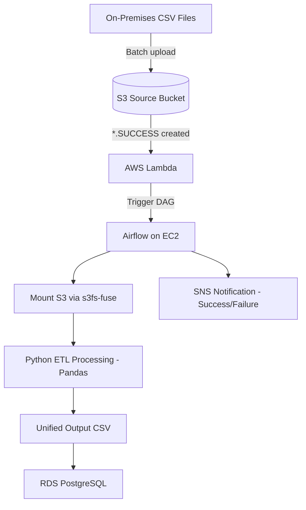

# Event-Driven Stock Market Data Migration Pipeline  
**On-Premises → AWS Cloud** | Airflow + Docker + RDS + S3 + Lambda

<p align="center">
  
</p>

## Project Overview

This project implements a production-grade, **event-driven ETL pipeline** for migrating and processing historical stock market data from an on-premises environment into AWS cloud infrastructure.

The solution automatically ingests batches of CSV files (up to 1000 files per run), transforms them into a unified dataset, loads the results into a managed PostgreSQL database on Amazon RDS, and provides success/failure notifications via Amazon SNS — all orchestrated through Apache Airflow running in Docker containers on EC2.

The pipeline is fully automated via S3 event notifications and AWS Lambda, following modern cloud-native data engineering best practices.

## 🎯 Objectives

- Migrate historical stock trading data to AWS
- Build a reliable, automated, and observable batch ETL pipeline
- Implement event-driven architecture using S3 + Lambda
- Orchestrate complex workflows with Apache Airflow
- Enable production-style monitoring and alerting
- Demonstrate clean infrastructure-as-code patterns and operational excellence

## 🏗️ High-Level Architecture



## ⚙️ Technology Stack

| Layer                | Technology                          | Purpose                                      |
|----------------------|-------------------------------------|----------------------------------------------|
| Orchestration        | Apache Airflow (Dockerized)         | Workflow definition & execution              |
| Compute              | AWS EC2 (t2.medium) + EDSA AMI      | Hosts Airflow scheduler + workers            |
| Storage (raw/output) | Amazon S3                           | Source data, scripts, processed files        |
| Database             | Amazon RDS PostgreSQL (db.t3.micro) | Persistent storage of cleaned stock data     |
| Event Automation     | AWS Lambda + S3 Events              | Triggers pipeline on file arrival            |
| Notifications        | Amazon SNS                          | Email alerts (success/failure)               |
| File System Access   | s3fs-fuse                           | Mounts S3 bucket as local filesystem         |
| Data Processing      | Python 3 + Pandas                   | CSV merging, filtering & transformation      |
| Data Loading         | SQL (COPY / INSERT)                 | Efficient bulk loading into PostgreSQL       |

## 📊 Functional Capabilities

| Capability                  | Description                                                                 |
|-----------------------------|-----------------------------------------------------------------------------|
| Batch ingestion             | Handles up to 1,000 small CSV files per execution                           |
| Data transformation         | Filters top companies, merges files, computes derived fields                |
| Data loading                | Bulk insert into single PostgreSQL table                                    |
| Event-driven execution      | Automatically triggered by `.SUCCESS` file upload to monitored S3 bucket    |
| Monitoring & alerting       | SNS email notifications (success / failure) with standardized subject lines |
| Observability               | Airflow task logs + CloudWatch + email alerts                               |

## 📁 Repository Structure

```
.
├── dags/
│   └── stock_etl_dag.py                # Main Airflow DAG
├── scripts/
│   ├── process_stock_data.py           # Core data transformation logic
│   ├── insert_query.sql                # SQL loading statement
│   ├── mount_and_process.sh            # Helper script (mount + run ETL)
│   └── top_companies.txt               # List of companies to include
├── lambda/
│   └── trigger_pipeline.py             # Lambda handler to invoke Airflow
├── docker/
│   ├── Dockerfile                      # Custom Airflow image (if used)
│   └── docker-compose.yml              # Local development/testing setup
├── docs/
│   ├── architecture.drawio             # Source diagram file
│   └── setup-notes.md                  # Detailed deployment walkthrough
├── submission/
│   └── resource_details.csv            # AWS resource information for grading
└── README.md
```

## 🔐 Security Considerations

- Least-privilege IAM role attached to EC2
- Security group with restricted inbound access (SSH + PostgreSQL 5432)
- RDS instance in default VPC with public access (for academic purposes only)
- No hardcoded credentials — uses IAM roles and instance profiles
- S3 bucket policies configured for controlled external access (marking)

## 🚀 Pipeline Execution Flow

1. Analyst / upstream system uploads `.SUCCESS` file to monitored S3 bucket
2. S3 Event Notification triggers AWS Lambda
3. Lambda invokes Airflow DAG (via CLI / HTTP / MWAA API)
4. Airflow executes tasks:
   - Mounts source S3 bucket using s3fs-fuse
   - Runs Python transformation script → produces unified CSV
   - Executes SQL load into RDS PostgreSQL
   - Sends SNS success/failure notification
5. Processed data available for downstream analytics

## 📌 Important Notes for Evaluators / Maintainers

- EC2 instance should be **stopped** (not terminated) after completion
- Elastic IP assigned for consistent access during grading
- SNS topic includes subscription to `edsa.predicts@explore-ai.net`
- Subject lines follow convention:  
  `FirstName_Surname_Pipeline_Success`  
  `FirstName_Surname_Pipeline_Failure`

## 🧹 Clean-up Reminder

After evaluation, delete the following resources to avoid unnecessary charges:

- Lambda function
- Monitored + source S3 buckets
- RDS PostgreSQL instance
- EC2 instance & associated Elastic IP
- SNS topic & subscriptions
- Airflow container environment

## Acknowledgments

Built as part of the **Explore Data Science Academy**  
**Data Engineering – Moving Big Data** predict

For academic demonstration purposes only.
