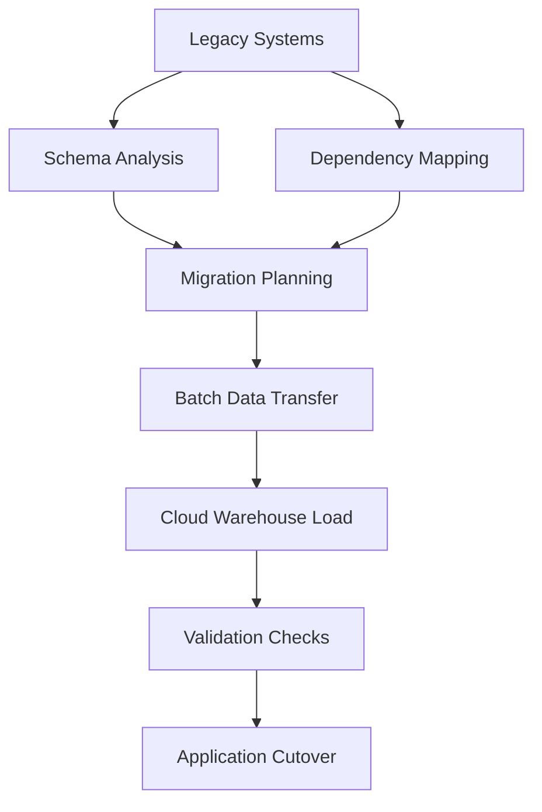
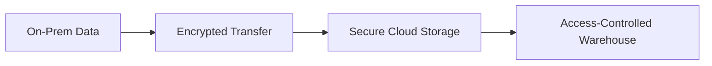
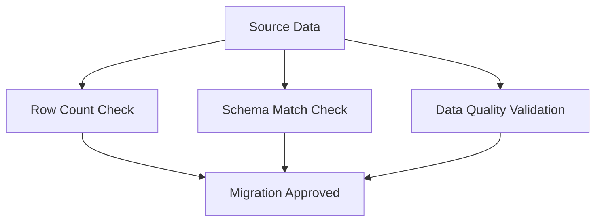

# Big Data Application Migration: On-Premises → Cloud

📦 Enterprise-grade migration of a large-scale data warehouse from legacy on-prem infrastructure to a modern cloud-native platform.

This project outlines a structured, low-risk strategy emphasising **scalability**, **performance**, **cost efficiency**, **data integrity**, and **business continuity**.

## 🎯 Objectives

- Reduce dependency on physical hardware and maintenance overhead
- Achieve elastic scalability for growing data volumes
- Unlock cloud-native analytics, ML, and BI capabilities
- Ensure near-zero data loss and schema fidelity
- Maintain high availability during transition
- Deliver faster queries and operational flexibility

## 🏢 Business Context & Challenges Addressed

Legacy on-premises data warehouses commonly suffer from:

- High CapEx and maintenance costs
- Limited vertical scalability
- Performance bottlenecks during peak loads
- Hardware refresh cycles and vendor lock-in
- Slow development & deployment velocity
- Complex and slow disaster recovery

This migration blueprint shows how organisations can modernise safely while preserving analytics continuity and data trust.

## 🧱 High-Level Architecture

## 🏗️ Migration Strategy

Phased, risk-controlled approach with parallel running where possible.

### Migration Phases

1. **Discovery & Assessment**  
   - Data asset inventory  
   - Schema & data profiling  
   - Volume & growth estimation  
   - Dependency & lineage mapping  
   - Risk & impact assessment  

2. **Planning & Architecture Design**  
   - Cloud platform & service selection  
   - Storage tiering and compute sizing  
   - Schema conversion / replication strategy  
   - Security, IAM, and compliance alignment  

3. **Data Migration Execution**  
   - Batch extraction from source systems  
   - Encrypted, reliable transfer to cloud object storage  
   - Incremental / full loading into target warehouse  

4. **Validation & Testing**  
   - Row count & checksum reconciliation  
   - Schema & data type consistency  
   - Statistical & business rule validation  
   - End-to-end performance benchmarking  

5. **Cutover & Optimization**  
   - Gradual workload shift (strangler pattern)  
   - Real-time monitoring & alerting  
   - Query & cost optimization  
   - Documentation & knowledge transfer  

## 🔐 Security & Compliance

Key controls implemented:

- End-to-end encryption (in-transit & at-rest)
- Least-privilege IAM roles & policies
- Federated / identity-based authentication
- Comprehensive audit logging & monitoring

## 📊 Data Validation Framework

Validation dimensions:

- Row counts & aggregate sums match
- Null rates, uniqueness, and range checks
- Duplicate & anomaly detection
- Schema compatibility & type mapping
- Statistical sampling & spot-check verification

## 🧠 Core Technologies

| Layer              | Tools / Technologies                     |
|--------------------|------------------------------------------|
| Source Systems     | On-prem relational/analytical databases |
| Migration Layer    | ETL batch pipelines, custom scripts  |
| Cloud Storage      | AWS S3                |
| Data Warehouse     | Snowflake|
| Validation         | SQL queries, dbt tests, custom frameworks|
| Monitoring         | Cloud-native logging & observability     |

## 📈 Business Benefits Realised

- Elastic scaling for seasonal / growing workloads
- Significant reduction in infrastructure OpEx
- 2–10× faster analytical query performance
- On-demand compute → pay-for-what-you-use model
- Modern, API-first data platform
- Enhanced reliability and geo-redundancy

## ⚠️ Key Risks & Mitigations

| Risk               | Mitigation Strategy                      |
|--------------------|------------------------------------------|
| Data loss          | Multi-stage reconciliation & validation  |
| Extended downtime  | Phased / parallel cutover                |
| Schema mismatches  | Automated schema diff & replication      |
| Performance regression | Pre- & post-migration benchmarking + tuning |
| Security exposure  | Encryption + strict access controls      |

## 📂 Overall Data Flow

## 👤 Author

**Asimiyu Musa**  
Data Engineer | Data Platform Architect | Analytics Consultant

Portfolio: [https://asimiyu-musa.github.io/project-portfolio/](https://asimiyu-musa.github.io/project-portfolio/)

Let me know if you'd like adjustments (e.g. more emphasis on a specific cloud provider, code snippets, or links to artefacts)! 🚀

